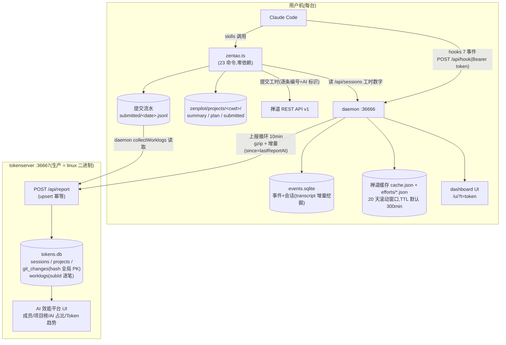
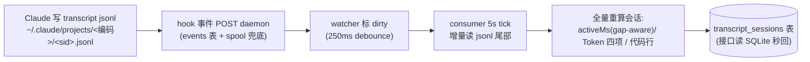
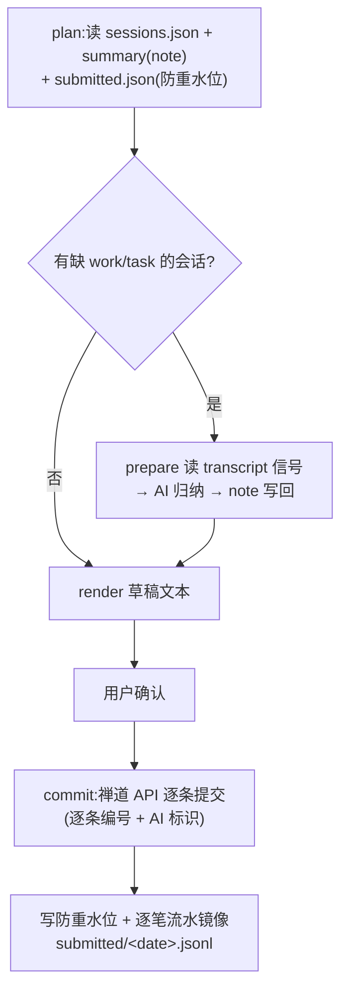
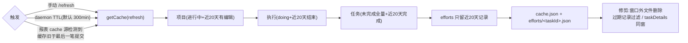
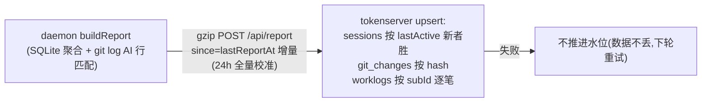
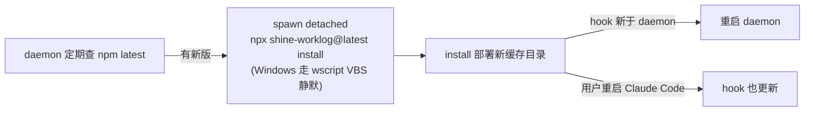

# 02 架构与数据流

## 全景图

> 原则:禅道是工时的**唯一事实源**(efforts),本地一切(sessions/plan/submitted)都是过程数据。

## 五条核心数据流

### ① 会话采集流(自动,无需用户操作)

### ② 工时提交流(/report,用户触发)

### ③ 禅道缓存流(refresh / TTL / 报表按需)

### ④ 上报流(daemon→tokenserver,10min)

### ⑤ 自动升级流(autoUpdate)

## 进程/模块边界(谁不依赖谁)

- skills(zentao.ts)**不依赖** daemon 运行——但工时数字读 daemon 接口(collect),daemon 不在则退化;
- daemon **不依赖** skills 运行,但禅道刷新是 spawn skills 的 zentao.ts(refresh);
- tokenserver 完全独立,只收 HTTP;
- hook 是纯转发器,daemon 不在时 ensureDaemon 自动拉起。

## 跨机/跨平台注意

- 所有日期比较用**本地时区日期串**(YYYY-MM-DD 字符串比较),不能用 toISOString(UTC);
- Windows:PowerShell 杀端口进程(git-bash taskkill 无效);spawn 子进程要 `detached:true`(node:child_process,Bun.spawn 无 detached 且 ignore stdio 会随父进程退出被杀——1.3.45/46 踩坑);
- 路径大小写:cwd 归一化比较用 normCwd(Windows toLowerCase),显示保留原样。
