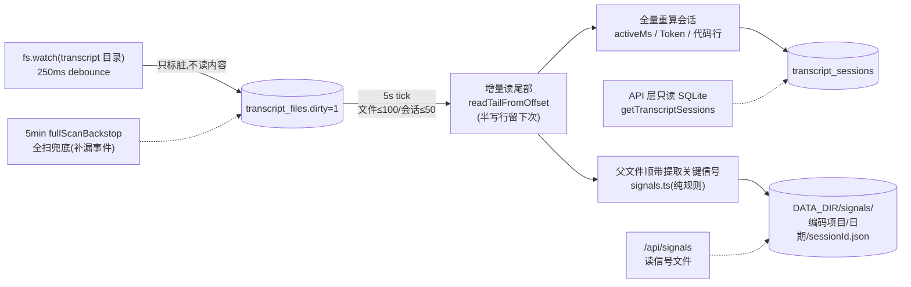

# 05 Daemon 子系统(src/daemon/)

[← 手册索引](README.md)

常驻后台进程(36666),会话数据中枢。源码模式 `bun run src/daemon/main.ts`,二进制模式 `bin/<plat>-<arch>/daemon.exe`。

## 启动流程(main.ts)

1. `ensureDirs()`;`isOursAlive()` 已有同族在跑 → 直接退出(防重复拉起);
2. 组装:Store(SQLite)→ EventBus → SpoolConsumer → WebSocketPool → TranscriptWatcher → TranscriptConsumer;
3. spool 启动回捞一次 + 1s 周期回捞;wsPool.attach;
4. 注册优雅关闭(SIGINT/SIGTERM/exit):按序 dispose,**只删属于自己的 pid 文件**;
5. `startServer()` —— **端口 bind 成功后才写 pid 文件**(`{pid, port, token, startedAt}`;token 持久化在 `daemon.token`,重启/升级复用同一 token,dashboard 链接不失效);
6. 升级检测:`lastDaemonVersion !== SERVICE_VERSION` → 重置 `lastFullReportAt=0`(下轮上报自动全量回填);
7. watcher.start + consumer.start。

## 数据中枢:watcher → SQLite dirty → consumer

接口读 SQLite 近实时秒回。

### 关键信号提取(signals.ts + signals-store.ts)

consumer 消费父 transcript 时顺带提取「决定性内容」(每行已读已 parse,边际成本≈0),写 `DATA_DIR/signals/<编码项目>/<日期>/<sessionId>.json`(原子写;日期=首个信号事件日,跨午夜会话留在开工日目录,API 按 lastAt 过滤不丢)。**不入 SQLite**——信号是提取产物非统计事实源,文件形态可浏览可清理,免 schema 迁移。

标识规则(2026-08 对真实 transcript 三轮分析定稿,零 LLM):

| 信号 | 规则 |
|---|---|
| turn 边界 | `type=system, subtype=turn_duration`,遇之闭合当前 turn |
| 本轮结论 | 每 turn **最后一条** assistant text block(≤800 字);thinking/工具结果全排除 |
| 用户意图 | user 行 string/array text:非 `<` 开头 wrapper、非 `Caveat:`、非 `[Request interrupted`、≤500 字 |
| git commit | Bash tool_use 匹配 `git commit`,取 `-m` message 首行(heredoc/引号双形态) |
| 任务清单 | TaskCreate/TaskUpdate `subject`、TodoWrite `todos[].subject` |
| 改动文件+行数 | Edit/Write/MultiEdit `file_path` + 行数(与 skills 层 countLines 同口径) |
| 现成总结 | `system/away_summary` content(Claude Code 原生 recap,覆盖率低,有则全收) |
| 会话标题 | `ai-title` 行,最后一条胜出(比 first-user-text 标题质量高) |
| 报表类标记 | assistant 行 `attributionSkill`(识别 /report /daily 等自身操作) |

无已有文件/损坏/截断 → 整文件回填一次(覆盖升级前历史);此后每 tick 增量合并新行。子代理文件不提取(与 skills 层 extractTranscriptSignals 同口径)。上限:turns 300/会话、conclusion 800 字等(防文件膨胀)。信号里的 cwd 取**首条**(first-wins,对齐 readFirstCwdFromText)——行内 cwd 是"当时"目录,会话中 cd 子目录不能覆盖,否则 /api/signals 按项目 cwd 过滤会查不到。

## events.sqlite 三表(store.ts)

| 表 | 主键 | 内容 |
|---|---|---|
| events | (session_id, event_id) | hook 事件;eventId 由内容派生 → INSERT OR IGNORE 幂等(多 hook 重复采集自动去重) |
| transcript_files | path | 每个 transcript jsonl 一行:offset/entries_blob/dirty(增量读取游标) |
| transcript_sessions | session_id | 会话聚合结果:token 四项/active_ms/last_activity/title/cwd/dirty |

WAL 模式;查询 `store.query({cwd, sessionId, type, since, limit≤2000, offset})`。

## HTTP/WS 服务(server.ts)

- 鉴权:`Authorization: Bearer <token>`(token 字符串比较);WS 用 `?t=`;
- `/api/health`(version 运行时读 package.json)、`/api/sessions`(L1 项目/L2 项目会话)、`/api/report`(自构建报表)、`/api/hook/<type>`、`/api/settings` GET/PUT、`/api/zentao-cache` GET + `/refresh` POST(in-flight 锁)、`/api/report/upload` POST(full=1 全量)、`/ui`(dashboard 静态资源)、`/api/ws`(实时事件推送)——完整清单见 09-api;
- **三个后台 tick**(每 60s tick 节流,间隔实时读 settings):
  - 自动上报:reportIntervalMin(默认 10min)→ uploadReport(buildReport → gzip POST tokenserver;**失败不推进水位**;24h 强制全量校准);
  - 自动更新:autoUpdateIntervalMin(默认 60min)→ 查 npm latest → spawn detached `npx shine-worklog@latest install`(Windows 走 wscript VBS 静默);
  - 禅道缓存:zentaoCacheTtlMin(默认 300min,本机常配 30)→ spawn `zentao.ts refresh`(in-flight 锁防并发)。

## 聚合与 git 模块

- `aggregate.ts`:/api/report、/api/projects、/api/sessions 三接口共享口径——cwd 分组用 `normCwd`(Windows 大小写/斜杠归一,**显示保留原始**)、hook 上报的 cwd 优先于项目名解码(`decodeProjectCwd` 有连字符误还原的已知缺陷);
- `signals.ts`/`signals-store.ts`:transcript 关键信号(见上文「关键信号提取」);/api/signals 与 skills prepare 消费,**不进 token/activeMs 计算链路**(ccusage 对齐零影响);
- `git.ts`:`git -C <cwd> log`(quotepath=false 保中文路径);`getCommitsInRange`(带 --since/--until,AI 占比分母)、`getAICommitHashes`(grep "Co-Authored-By: Claude");
- `lines.ts`:PostToolUse 的 structuredPatch 数行;`getProjectAILines` 构建「AI 编辑过的行集合」(分页翻页突破 2000 cap;**isTrivialLine 过滤空行/纯括号**,防 aiAdded 虚高——1.3.44);
- `worklog.ts`:读 `zenpilot/submitted/*.jsonl` 提交流水,上报时逐笔镜像给 tokenserver。

## 修改注意

- daemon 改动要重启才生效(health 的 version 会伪装——运行时读的是新 package.json,验证重启看 **pid+uptime** 不看 version);
- Windows 端口占用(EADDRINUSE)残留进程:PowerShell `Get-NetTCPConnection` 杀,git-bash taskkill 无效;
- 与 skills 的禅道刷新是 spawn 关系,`refreshZentaoCache` 有 in-flight 锁但 CLI 手动 refresh 不经锁(cache 写已原子,最坏互相覆盖等价内容)。
