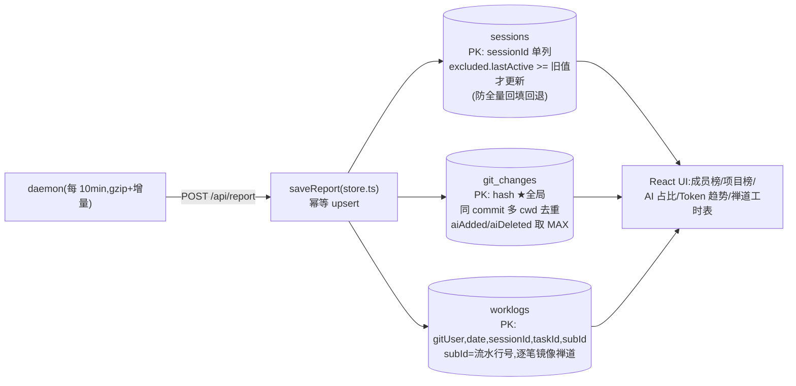

# 07 Tokenserver 子系统(tokenserver/)

[← 手册索引](README.md)

独立部署的数据汇聚服务 + AI 效能平台。生产为 linux-x64 单文件二进制(`scripts/build.ts` 打包,95MB 内含 UI),开发模式 `bun run tokenserver/src/main.ts`(数据落 `tokenserver/data/`,gitignored)。

## 架构



## 关键实现(store.ts)

- **host 白名单**(aiStatsHosts 配置):`extractGitHost` 提取 remote 的 host 后**等值比较**(1.3.44 改;原 LIKE 子串会误命中 `my-github.company.cn`);无 remote/解析失败 → 排除;
- **AI 占比口径**:分子=行级匹配(aiAdded+aiDeleted),分母=commit added+deleted;只统计「有 transcript 覆盖(aiAdded/aiDeleted 任一>0)」的 commit(纯删除型 1.3.44 起不再丢弃);`getDenominatorBreakdown` 按 cwd/有无 AI 覆盖拆分(no-ai 桶 1.3.44 修复);
- **迁移**:worklogs 重建迁移单事务(rename→拷→drop→重建索引);残留 `worklogs_old` 表会让启动崩(罕见);
- **只增不删**:禅道侧删除/改小的记录在平台永久残留(已知设计缺口,全量上报无法收敛)。
- **分页**:`getSessions`/`getMemberWorklogs` 用 SQL `LIMIT/OFFSET` + `COUNT(*)` + `SUM(hours)`,不再全表拉内存 slice(2026-08-20 改,新旧实现对拍等价);排序固定 `lastActive DESC, sessionId` / `date DESC, sessionId`,次级键防碰撞值跨页重复/漏行。

## UI(tokenserver/ui/)

React 19 + tailwind(打包时编译内联)+ react-day-picker。页面:成员列表/成员详情(KPI+Token 构成+趋势+禅道工时表分页)/项目榜/AI 占比(含分母构成弹窗)/数据说明页(数据说明.md 经 **marked(GFM)** 渲染成 `ui/.build/docs.html`,build-docs.ts 的 heading 渲染器包章节卡+目录,h1 跳过、hr 丢弃;改 md 后重跑 build-docs 或 build 全流程)。

## 打包与部署

```text
cd tokenserver && bun run scripts/build.ts
# 0. tailwind css → 1. bundle ui → 2. 生成 src/ui-assets.ts(内联)→ 3. bun build --compile --target bun-linux-x64
# 产物 bin/tokenserver-linux-x64(gitignored)
```

生产部署:scp 到生产机替换 → nohup 重启。⚠️ daemon 侧新上报兼容旧二进制(extra 字段被忽略,不崩),但**占比口径修复需重新部署才生效**。

⚠️ **部署时序铁律(2026-08-17)**:daemon 侧 events 表已改 7 天滚动修剪,超窗老会话行数上报 **NULL**——**旧二进制会把 NULL 洗成 0**,全量校准时清零平台 `sessions` 行数历史。**必须先部署含 COALESCE 的新二进制**(`sessions` upsert 行数三列 `COALESCE(excluded.x, sessions.x)`,接收侧 `l?.added ?? null` 透传),再恢复 daemon 对本服务的自动上报。git_changes 的 aiAdded 用 MAX 天然防降级,不受此约束。

## 鉴权(2026-08-19 落地,原「全接口无鉴权」待办关闭)

接收端两级鉴权,配置在 `TOKENSERVER_DATA_DIR/config.json`(字段)或 env(优先),**每次请求重读、改后即时生效无需重启**:

- **POST /api/report → HMAC 验签**:`reportSecret`(env `TOKENSERVER_REPORT_SECRET`)。daemon 对实际发送的 gzip 字节签名(`x-report-ts` + `x-report-sig` = HMAC-SHA256(密钥, ts||原始字节)),服务端**先验签再 gunzip/解析**(垃圾请求在解压前被挡)。ts 窗口 ±15min:容忍成员机与服务端时钟偏移;窗口内重放因 upsert 幂等(lastActive 旧值不覆盖)无害,不加 nonce。未配密钥放行(迁移期兼容不带签名的老 daemon),启动日志 + 首条上报打警告——**公网部署必须配**。
- **GET /api/* → viewToken**(env `TOKENSERVER_VIEW_TOKEN`):配了后除 `/api/health` 外全部读接口要 `?t=<viewToken>` 或 `Authorization: Bearer <viewToken>`;看板链接形如 `/?t=<viewToken>`(UI 从 URL 透传到所有 API 请求,401 时提示用带 token 的链接打开)。静态页(`/`、`/ui/*`、`/docs`)开放。
- **daemon 侧对应**:settings.json 的 `reportSecret`(dashboard 设置页可配)。密钥不一致 → 401,daemon 返回 skipped 且**不推水位不丢数据**,配对后自动续传。
- **默认 reportUrl 已改空**:公开 npm 用户装完不再默认报到他人服务器,团队内部装完在设置页配地址+密钥。
