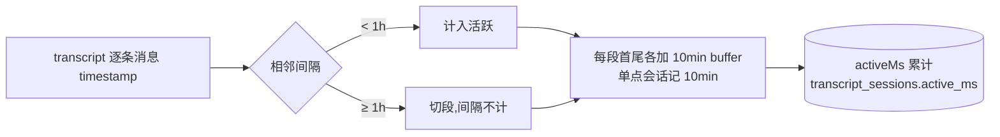
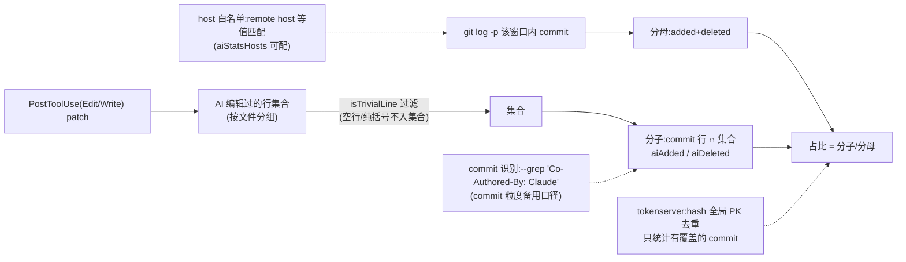

# 10 核心机制专题

[← 手册索引](README.md)

改这些机制前必读——每条都踩过坑。

## ① 工时计算(gap-aware)

**口径:与 Claude 对话的活跃度**(非代码量、非真实工时;离开 Claude 自己干的 gap 不计)。



位置:`src/daemon/transcript-consumer.ts`(全量重算,增量只优化读取)。详见根目录《对话时长统计说明.md》。

## ② 汇报工时与水位防重

- `hoursFromMinutes`:取整到 0.5h 粒度(roundPy 银行家舍入,非纯向上)、最小 0.5h;
- **多天补报范围**:collect 起点 = `lastSubmitSinceEpoch()`(submitted.json 最大日期 key 的 0 点,clamp 到 `LOOKBACK_MAX_DAYS=14` 天前;无记录回退今天 0 点)——某天忘了提交/提交后有增量,之后任意一次 /report 都会补上;补报条目按会话归属日(`item.date`,lastActive 推)提交禅道/记台账/分日流水(**局限:跨天会话整体归最后活跃日,在昨天会话里继续对话会把昨天工时带进今天——SKILL 防呆:点名日期时不走 auto、render 后核对归属日**);`_meta` 按归属日分组写,同一次 commit 的各日期 key 盖**同一 `lastCommitAt`**——amend 全局扫最大时间戳并合并同值天数的 `lastCommit`,多天混合提交也能精确定位「最后一次提交」;
- **元会话聚合**(zentao.ts `aggregateMetaItems`):跑 /report//prepare//amend 本身产生的 skill 会话(识别:daemon title 含 `skills\report|prepare|amend` **∪ signals 兜底**——斜杠命令会话标题抓不到路径(summary="(无文本提示)",2026-08-21 盲区)时读 `DATA_DIR/signals/<编码项目>/<date>/<sid>.json` 的 `turns[].skills` 里的 `shine-worklog:report|prepare|amend` 标签;两者都限活跃<45min 双保险——weekly/daily 报表会话是正常工作、大活跃会话可能在 skill 里干了真开发)同日合并一条:固定文案「执行 shine-worklog 工时填报流程」+ **时间区间并集去重工时**(重叠会话不双计,`unionMinutes`)+ `sourceSessions` 防重清单(commit 后各源记水位 hours=0/minutes=各自 → 下次即已提交、不进 items,填报工时不再自我繁殖);**⚠️ 聚合条不计入工时(2026-08-20 用户定:报工时动作占用的时间不算工时)——分步流程 SKILL 第 3 步删掉该条目、auto 内置排除**(cmdAuto 过滤 meta 条目并回写 plan.json;cmdRender/commit 读盘故必须回写,纯内存过滤无效);increment 的 meta 不并入(语义不同);needs_semantic 的 meta 免 AI 归纳直接按 `inferProjectTask` 历史归属(无历史 → unmatched 留 /report 问一次);
- **水位**:`submitted.json` 按 (date,session) 记 {tasks,hours,minutes,_meta.lastCommitAt};增量 = activeMinutes − rec.minutes(原始分钟);跨日期全扫取最大水位(跨午夜兼容);
- **增量 note 过滤严格大于**(1.3.44 修):`notedActiveMinutes > submittedMin`——相等也算已提交(note 水位 123min vs 取整提交 120min 曾重复混入);increment 的 **work = 水位后全部新 note 按时间合并**(旧→新、**行级** dedupLines 去重——跨 note 重复行(如 commit subject 在相邻窗口回退重复)只留一次,防回声行、≤`MAX_INCREMENT_WORK_LINES`=10 行,超出保留最新并加「…(更早 N 条略)」)——单取最新会丢增量区间内的关键改动(08-18 实测 4 条 note 只剩最后 1 条、前 3 个功能 commit 全丢;早先 b24a992 改单取是怕混排 join 不搭,现 auto note 自身已是窗口全量总结,顾虑已化解);多行是预期产物,render/numberWork 天然按行编号;
- 阈值:增量 ≥15min 才补报;**<15min 的已提交会话不进 items 输出,仅顶层 `alreadyCount` 计数**(08-18 用户定:提交后再跑 /report,草稿/AI 汇报均不得复述已提交条目——曾逐条展开 18 行「0.0小时」刷屏);防重由 submitted 分钟水位保证,不受展示层影响;render 增量条目带 `deltaMinutes` 显示「起—止,新增 Nmin,X小时(增量)」——时间窗仍是全会话、工时只算水位后增量,补「新增 Nmin」消歧(08-18 实测 103min 窗口配 0.5h 引发算错质疑);两次 commit 冷却 30min(全局取最近 lastCommitAt——含历史日期 key,补报场景最后一次提交可能落在昨天;amend 可豁免同会话);
- 多 note 拆段:按水位切段拆 task,段膨胀检测(segSum > totalHours)合并回单条。

## ③ 禅道缓存 20 天滚动窗口(EFFORT_FRESH_DAYS=20,1.3.41)

```text
项目:doing 且 left>0,或近 20 天有编辑
执行:doing,或计划结束在窗口内(执行无 lastEditedDate,用 end 近似)
任务:未完成(doing/wait)全量 + 近 20 天完成的(lastEditedDate)
记录:efforts 只保留近 20 天(无日期记录滤除)
修剪:窗口外任务文件删除;taskDetails 同窗;损坏 JSON 容错清理
```

「与近 20 天工时关联的都拉」;更早历史/已关闭执行 → 禅道实时源兜底(靠 submitted.json 收集任务 id)。
报表聚合任务集合 = submitted.json ∪ cache.tasks(未完成)∪ cache.taskDetails(已完成)——任务转 done 只是换库不丢工时(#78363 修:曾因聚合集合漏 taskDetails,任务当天完成后其当日工时从日报 cache/zentao 两源同时消失)。
- **日报 `--from`/`--to` 跨天区间**:按天分区逐日渲染(`day-block` 分区标题),合计为区间累计——不丢天(2026-08-21 修:旧实现只渲染首日静默丢天)。

## ④ 报表侧按需刷新(1.3.46 → cache 源真离线)

daily/weekly/lastweek `--source cache` 为**真离线**:跳过禅道登录、0 网络(daily/weekly/lastweek/plan 传 client=undefined;getCache 对缺失/过期/损坏缓存明确报错提示联网,不硬闯联网段)。`cacheStaleVsSubmissions`(cache.fetchedAt vs submitted/<date>.jsonl 末行 ts)发现缓存旧于最后一笔提交 = 已知有更新的数据却无法联网刷新 → **明确报错**,不静默产出缺数报表。刷新不再收拢到 cache 源,改走:①`--source zentao` 实时源 ②`refresh` 命令 / dashboard「更新禅道」 ③daemon 后台定时刷新(`zentaoCacheTtlMin`,默认 300min)。**daemon 定时刷新水位**:刷新**成功才推进** `lastCacheRefreshAt`,失败不推 → 下个 60s tick 立即重试(避免「过期了但一直不更新」);失败打 warn 日志(in-flight 锁命中静默跳过,不算失败),从日志可定位「为何没刷」(2026-08-21 修:原实现刷新前就推水位+失败静默,静默失败后要再等一个 TTL)。**报表姓名**:refresh 时拉 `/user` 把禅道中文名 `realname` 存进 cache.json;cache 源真离线(client=undefined)时报表从缓存读中文名(文件名 + hero 姓名),**不退化英文 account**(2026-08-21 修:真离线化曾让 realname 一律回退 account)。
> 历史:1.3.45 曾做「commit 后 detached spawn 刷新」,Windows 跨进程三连坑后废弃;1.3.46-1.4.7 做「cache 源发现 stale → 同步自动刷新(autoRefreshed:true)」,2026-08-21 因与 SKILL「本地缓存不联网」承诺矛盾改为真离线(用户拍板:缓存源不再自动联网刷新)。

## ⑤ 提交格式与 AI 标识

- `numberWork`:work 按 `;／；/\n` 拆条 → 去行首旧序号(正则 `^\d{1,3}[.、](?!\d)`,(?!\d) 防「3.0 升级依赖」误剥)→ 重排 1..N → **每条行尾拼标识**(幂等)→ `\n` 换行;
- 标识「(本次内容由AI填报)」配置于 settings.aiSubmitMark;对账 `isAiWork` 按整条末尾命中;
- 报表渲染:`\r` 清除、`\n`→`<br>`;SKILL 流程中 AI 统一排版(编号顺延/全角标点/结构化分块/标识留末尾)。

## ⑥ AI 代码占比



已知:行级字符串匹配有天花板(改一行也算 AI),口径细节见效能平台数据说明页。
⚠️ 归属口径(2026-08-18 修):集合构建**不限事件 cwd**——会话在子目录里跑时 hook 记录的 cwd 是子目录,按项目 cwd 精确等值查会整段漏掉(实测单日占比被吃 ~40 个百分点;大小写盘符变体同症);现按 **file_path 落在项目内**(normRelPath 不逃逸 `../`)判定归属,异盘 cwd 编辑项目内文件(绝对路径)也纳入。
⚠️ 数据源时效(2026-08-17):AI 行集合与行数统计读 events 表 PostToolUse 的 structuredPatch,**events 7 天滚动修剪**——超 7 天的会话行数上报 null(无数据≠零行,tokenserver COALESCE 保留旧值),AI 行集合超期不可回溯(git_changes 用 MAX 天然防降级,平台历史安全)。

## ⑦ 上报增量与幂等

daemon 每 10min:`buildReport(since=lastReportAt)` → gzip POST;**失败不推进水位**(1.3.44 修,曾 404 也推水位丢增量);24h 强制全量校准;tokenserver 三表 upsert 幂等(sessions 按 lastActive 新者胜、git_changes 按 hash、worklogs 按 subId)。

## ⑧ autoUpdate 自升级

daemon 定期查 npm latest → spawn detached `npx shine-worklog@latest install --silent`(Windows wscript VBS 静默)→ install 部署新版本目录 + 按 startedAt/installedAt 判断重启 daemon → SessionStart hook 清理旧版本目录(保留 5 版本)。版本比较 `versionGt` 数值逐段;hook↔daemon 版本同步只在 **hook 新于 daemon** 方向重启。
⚠️ 新版本目录整拷会覆盖 dashboard Skills 模块编辑过的 SKILL.md(markdown)——备份在 `DATA_DIR/skills-edits/`,不自动重放(见 06-skills「修改注意」);实时 skills 视图完全以当前插件版本为准、无 stale 提示,旧编辑的查看/恢复全走「备份 skills」tab(浏览各版本备份与保存历史快照,只读、DiffEditor 对比实时、复制片段、一键「恢复到实时」按 savedAt 恢复任意保存点);备份目录 `DATA_DIR/skills-edits/` 内含各版本可读 `md/<rel>` 镜像,便于磁盘上直接查看。

## ⑨ 安装与迁移(install/)

`npx shine-worklog install`:migrateLayout(1.3.0 改名一次性迁移:停旧 daemon→迁 DATA_DIR→迁 ~/.zenpilot→清旧插件)→ cleanupOldPlugin(无条件反注册 shine-code-submit)→ ensureBun(自动装 bun)→ deployPlugin(白名单拷贝到 `~/.claude/plugins/cache/shine-worklog/shine-worklog/<version>/` + bun install(`--backend=copyfile` 纯复制,防杀软把 bun 默认 hardlink/symlink 判为「创建文件链接绕过防护」误拦,见 [15 章 ⑤](15-install-troubleshooting.md)) + 幂等标记)→ 注册三处 JSON(known_marketplaces/installed_plugins/settings enabledPlugins+path 修正)→ 拉 daemon(版本感知:同版本且进程新则复用)。
⚠️ npm 包**纯源码无 exe**;本地路径 install 会把本地 build 的 exe 混进缓存(版本固化问题,见记忆 daemon-exe-version-pinned-at-compile)。

## ⑩ transcript 关键信号预提取(/report 提速)

问题:/report 对 `needs_semantic` 会话需现场读完整 transcript(1~11MB)逐行 parse 再由 AI 归纳——填报耗时长。

方案:consumer 每次增量消费父 transcript 时**顺带**按结构标识提取关键内容(每行本就已读已 parse,边际成本≈0),写 `DATA_DIR/signals/<编码项目>/<日期>/<sessionId>.json`(详见 05-daemon「关键信号提取」);`prepare` 优先读 daemon `/api/signals`(秒回),老会话未提取/daemon 不可达时退化原直读。AI 拿到的是「逐 turn 结论 + commits + 任务清单 + 用户意图」(压缩比 ~100-1000x),归纳 work 的素材更全更小。

边界:只取父文件(子代理不提取);turn 上限 300;conclusion 不截断全量保存(实测全存代价仅 +10%);不上报 tokenserver(含用户 prompt/assistant 文本,仅本地);不碰 token/activeMs 计算链路(ccusage 对齐零影响)。

## ⑪ auto-note:Stop 自动归纳 work+task(零 LLM)

问题:归纳 work+task 原本靠 AI(/prepare 手动或 /report 现场补,一次约 1m48s 且大头是 AI 思考)——能不能每轮对话结束自动完成、无感?

方案:**conclusion 即 work**——daemon 预提取的 `signals.turns[].conclusion`(Claude 本轮结论文本)已是自然语言汇报,零 LLM 取用:

```text
Stop/SubagentStop → hook detached fork zentao.ts collect(现有,不阻塞无输出)
 → collect 尾部 autoNote(session_id 取自 stdin payload):
    GET /api/signals?sessionId= 精查(不受 since/200 上限影响,open turn 也并入)
    → 水位后新 turns 窗口全量:每 turn 的 conclusion 各精简一行(空/无信息量的 turn 有 commits 则记 subject 行),旧→新 join
    → simplifyConclusion:行级跳过(标题/**加粗行首**「**1. xxx** — …」修复报告的开场标题,markdown 剥离前 `**` 开头拦不到数字列表正则/列表/引用/**代码围栏含内部行**( ``` 状态机开关注入,围栏里的代码/正则原文不是结论——曾漏过并截在代码内嵌 。 上)/**markdown 表格行**/**引导语**「草稿如下:」「请核对:」等以冒号或「如下」收尾的开场白/**流程状态语**「已取消,本次不提交」「工时草稿 ZR-…」「plan 已出:…」(/report 轮自己的开场结论)/**报表状态语**「周报已生成完毕…」「日报已生成…」(报表会话的完成播报,非工作成果)/**草稿引用行**「[1] 日常工作/…」/**时钟时间行**「09:45—12:11,2.0小时」/**API 错误残行**「API Error: Connection lost…」(errored turn 的 conclusion 即错误文案)/**草稿标签行**「理由:」「置信度:」「说明:」「修法:」「根因:」「解法:」(/report 解说与修复汇报的叙述开头,同族一并拦)/**对话残留行**(回复用户提问的建议「…的话…即可」「说一声」、名词解释「「X」是…」、预告「后续自动发生:」、承接解释「所以…」、评审叙述「这轮 AI 的快修…」、收束语「至此」)/<10 字短行——2026-08-18 实测十二类垃圾文案各堵一轮)→ 取正文首句(≤120 字,去行内 markdown;**半角 `.!?;` 仅在词边界(后跟空白/行尾)算句末**——config.json/1.3.51/域名的点不当句终,否则产出「把真实 config.」残句);全跳过 → null 不记(下次自愈)
    → 回声已治:AI 回复里引用的 note/草稿正文行可被选为结论(与别条 work 重复)——join 层**行级 dedupLines** 通用去重(增量/膨胀合并两路径,1.3.52 后);note 单窗口内重复由 buildAutoWork 自身 dedup 兜底
    → conclusion 空的 turn 回退 commits subjects,并剥 conventional-commit 类型前缀(feat(report): 等)留正文
    → dedupLines 去重(归一化去空白标点,互含只留长者)→ ≤MAX_AUTO_NOTE_LINES(4)行,超出保留最新并加「…(前 N 轮略)」;全无素材 → 不记且不推进水位(下次 Stop 自愈)
    → task = inferProjectTask(该会话历史 → 项目最近 → -1 留 /report 问)
    → appendNote 写 summary(auto:true + sigLastMs=最新 turn endMs)
```

- **水位**(zentao.ts `noteWatermark`):扫 summary 取 max(sigLastMs, **手动** note 的 ts)——手动 note 覆盖「记的时刻之前」故 ts 计入;auto note 只用精确 sigLastMs,ts 不计入(否则水位被推到写入时刻,跳过 daemon 消费 tick 滞后产生的 turn 漏记);
- **节流** `AUTO_NOTE_MIN_INTERVAL_MS=10min`:距上一条 note(任意来源)<10min 跳过——防快速连续 Stop 刷碎条;拆段语义不受影响(下次 note 的段=上条水位起);节流窗内多个 turn 不丢(窗口全量 join,下次触发补齐窗内全部结论——08-18 前「只取最新」会永久丢中间 turn);
- **与手动 note 共存**:AI 顺手 note 质量更高且 ts 计入水位,刚记过 auto 不重复;同段双记由 plan 拆段膨胀合并兜底(工时正确);
- **开关** settings.autoNote(默认开);daemon 不可达/提取滞后 → 静默跳过,绝不出声;
- 时序:Stop 瞬间 conclusion 最坏落后 ~250ms+5s 消费 tick → 表现为「最新 turn 没记上」,下次 Stop 自愈(水位未推进)。

效果:/report 时 summary 已就绪 → 全 resolved → auto 一键秒级;`/prepare` 退化为补漏/重归纳工具。
