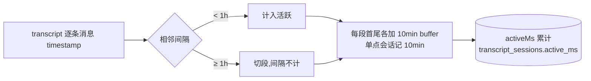
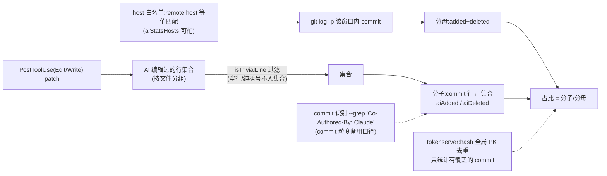

# 10 核心机制专题

[← 手册索引](README.md)

改这些机制前必读——每条都踩过坑。

## ① 工时计算(gap-aware)

**口径:与 Claude 对话的活跃度**(非代码量、非真实工时;离开 Claude 自己干的 gap 不计)。



位置:`src/daemon/transcript-consumer.ts`(全量重算,增量只优化读取)。详见根目录《对话时长统计说明.md》。

## ② 汇报工时与水位防重

- `hoursFromMinutes`:取整到 0.5h 粒度(roundPy 银行家舍入,非纯向上)、最小 0.5h;
- **水位**:`submitted.json` 按 (date,session) 记 {tasks,hours,minutes,_meta.lastCommitAt};增量 = activeMinutes − rec.minutes(原始分钟);
- **增量 note 过滤严格大于**(1.3.44 修):`notedActiveMinutes > submittedMin`——相等也算已提交(note 水位 123min vs 取整提交 120min 曾重复混入);
- 阈值:增量 ≥15min 才补报;两次 commit 冷却 30min(amend 可豁免同会话);
- 多 note 拆段:按水位切段拆 task,段膨胀检测(segSum > totalHours)合并回单条。

## ③ 禅道缓存 20 天滚动窗口(EFFORT_FRESH_DAYS=20,1.3.41)

```text
项目:doing 且 left>0,或近 20 天有编辑
执行:doing,或计划结束在窗口内(执行无 lastEditedDate,用 end 近似)
任务:未完成(doing/wait)全量 + 近 20 天完成的(lastEditedDate)
记录:efforts 只保留近 20 天(无日期记录滤除)
修剪:窗口外任务文件删除;taskDetails 同窗;损坏 JSON 容错清理
```

「与近 20 天工时关联的都拉」;更早历史/已关闭执行 → 禅道实时源兜底(靠 submitted.json 收集任务 id)。

## ④ 报表侧按需刷新(1.3.46)

daily/weekly `--source cache` 时:`cacheStaleVsSubmissions`(cache.fetchedAt vs submitted/<date>.jsonl 末行 ts)发现缓存旧于最后一笔提交 → **先同步刷新再读**,输出 `autoRefreshed:true`。
> 历史:1.3.45 曾做「commit 后 detached spawn 刷新」,Windows 跨进程三连坑(Bun.spawn 无 detached / unref 拖慢 commit / ignore stdio 子进程被父进程带掉)后废弃。**教训:Bun 下要后台存活子进程必须 node:child_process 的 detached:true。**

## ⑤ 提交格式与 AI 标识

- `numberWork`:work 按 `;／；/\n` 拆条 → 去行首旧序号(正则 `^\d{1,3}[.、](?!\d)`,(?!\d) 防「3.0 升级依赖」误剥)→ 重排 1..N → **每条行尾拼标识**(幂等)→ `\n` 换行;
- 标识「(本次内容由AI填报)」配置于 settings.aiSubmitMark;对账 `isAiWork` 按整条末尾命中;
- 报表渲染:`\r` 清除、`\n`→`<br>`;SKILL 流程中 AI 统一排版(编号顺延/全角标点/结构化分块/标识留末尾)。

## ⑥ AI 代码占比



已知:行级字符串匹配有天花板(改一行也算 AI),口径细节见效能平台数据说明页。
数据源(2026-08-17 终局):AI 行集合与行数统计改读 `DATA_DIR/ailines` 文件——transcript 的 Edit/Write 提取(old/new 行级前后缀裁剪对齐 patch context 语义,失败编辑按 tool_result 延迟剔除),90 天回填窗口、历史完整可重建;events 表彻底停用。行数查不到仍报 null(无数据≠零行,tokenserver COALESCE 保留旧值)。

## ⑦ 上报增量与幂等

daemon 每 10min:`buildReport(since=lastReportAt)` → gzip POST;**失败不推进水位**(1.3.44 修,曾 404 也推水位丢增量);24h 强制全量校准;tokenserver 三表 upsert 幂等(sessions 按 lastActive 新者胜、git_changes 按 hash、worklogs 按 subId)。

## ⑧ autoUpdate 自升级

daemon 定期查 npm latest → spawn detached `npx shine-worklog@latest install --silent`(Windows wscript VBS 静默)→ install 部署新版本目录 + 按 startedAt/installedAt 判断重启 daemon → SessionStart hook 清理旧版本目录(保留 5 版本)。版本比较 `versionGt` 数值逐段;hook↔daemon 版本同步只在 **hook 新于 daemon** 方向重启。

## ⑨ 安装与迁移(install/)

`npx shine-worklog install`:migrateLayout(1.3.0 改名一次性迁移:停旧 daemon→迁 DATA_DIR→迁 ~/.zenpilot→清旧插件)→ cleanupOldPlugin(无条件反注册 shine-code-submit)→ ensureBun(自动装 bun)→ deployPlugin(白名单拷贝到 `~/.claude/plugins/cache/shine-worklog/shine-worklog/<version>/` + bun install + 幂等标记)→ 注册三处 JSON(known_marketplaces/installed_plugins/settings enabledPlugins+path 修正)→ 拉 daemon(版本感知:同版本且进程新则复用)。
⚠️ npm 包**纯源码无 exe**;本地路径 install 会把本地 build 的 exe 混进缓存(版本固化问题,见记忆 daemon-exe-version-pinned-at-compile)。

## ⑩ transcript 关键信号预提取(/report 提速)

问题:/report 对 `needs_semantic` 会话需现场读完整 transcript(1~11MB)逐行 parse 再由 AI 归纳——填报耗时长。

方案:consumer 每次增量消费父 transcript 时**顺带**按结构标识提取关键内容(每行本就已读已 parse,边际成本≈0),写 `DATA_DIR/signals/<编码项目>/<日期>/<sessionId>.json`(详见 05-daemon「关键信号提取」);`prepare` 优先读 daemon `/api/signals`(秒回),老会话未提取/daemon 不可达时退化原直读。AI 拿到的是「逐 turn 结论 + commits + 任务清单 + 用户意图」(压缩比 ~100-1000x),归纳 work 的素材更全更小。

边界:只取父文件(子代理不提取);turn 上限 300;conclusion 不截断全量保存(实测全存代价仅 +10%);不上报 tokenserver(含用户 prompt/assistant 文本,仅本地);不碰 token/activeMs 计算链路(ccusage 对齐零影响)。
