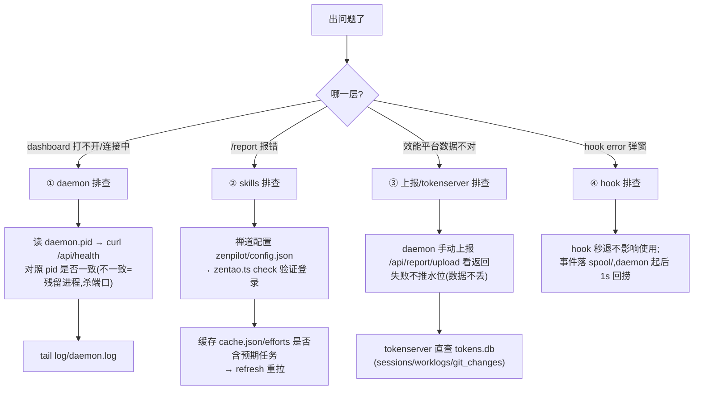

# 15 安装部署与问题排查(运维视角)

[← 手册索引](README.md)

面向**装机、运维、排查**的章节:装完后东西都在哪、出了问题从哪查起。开发向内容见前几章。

## 一、安装部署

### 用户机安装(一条命令)

```bash
npx shine-worklog install        # 前提:机器有 Node.js(npx 要用)
```

安装器依次做(详见 10-mechanisms ⑨):自动装 bun(若无)→ 部署插件源码到 Claude 插件缓存 → 注册三处配置 → 拉起 daemon → 打印 Dashboard 链接。装完**重启 Claude Code**,`/report` `/daily` 等 skill 可用。

卸载:`npx shine-worklog uninstall`;查看状态:`npx shine-worklog status` 或 `shine-worklog status`(全局安装后)。

### tokenserver 部署(服务端,linux)

```bash
cd tokenserver && bun run scripts/build.ts     # 产出 bin/tokenserver-linux-x64(95MB,UI 内联)
scp bin/tokenserver-linux-x64 <生产机>:~/tokenserver
# 生产机:nohup ./tokenserver >/dev/null 2>&1 &   # 监听 :36667,数据落 <二进制旁>/data/tokens.db
```

⚠️ 占比口径类修复(1.3.44 起)必须重新部署二进制才生效;daemon 侧无需手动部署(autoUpdate 自升级)。

## 二、安装后目录位置(分操作系统)

### 数据目录(DATA_DIR)——排障首先看这里

| OS | 路径 | 依据 |
|---|---|---|
| **Windows** | `C:\Users\<用户>\AppData\Local\shine-worklog\` | `%LOCALAPPDATA%` |
| **Linux** | `~/.local/share/shine-worklog/` | XDG 兜底 |
| **macOS** | `~/.local/share/shine-worklog/` | ⚠️ 同 Linux(代码只认 `%LOCALAPPDATA%`,**不是** `~/Library/Application Support`——macOS 上找不到数据时先想起点) |

目录内容(三个 OS 结构相同,详见 08-data):

```
DATA_DIR/
├─ daemon.pid            # 排障第一入口:{pid, port, token} —— 401/token 问题看这里
├─ daemon.token          # 持久 token(重启/升级不变)
├─ db/events.sqlite      # 会话/事件主库(可删重建,重扫 10-30s)
├─ log/daemon.log        # 运行日志(5MB 轮换;install.log 也在此,silent 安装诊断)
├─ spool/                # hook 发送失败暂存(堆积=daemon 长期没起)
├─ settings.json         # 行为配置(reportUrl/TTL/autoUpdate)
├─ reports/              # 日报/周报 HTML
└─ zenpilot/             # 工时链路(config.json 禅道密码/cache/efforts/submitted/projects)
```

### Claude Code 插件缓存(skills 与 hook 代码在这)

| OS | 路径 |
|---|---|
| Windows | `C:\Users\<用户>\.claude\plugins\cache\shine-worklog\shine-worklog\<版本>\` |
| Linux / macOS | `~/.claude/plugins/cache/shine-worklog/shine-worklog/<版本>/` |

- 同目录下保留**最近 5 个版本**(SessionStart hook 自动清理旧版,防多会话升级冲突);
- 排障时确认这里的 `<版本>` 与 npm latest 一致(autoUpdate 是否生效);
- 配了 `CLAUDE_CONFIG_DIR` 的机器,`.claude` 在该目录下。

### 插件注册(三处配置)

| OS | 文件 |
|---|---|
| Windows | `C:\Users\<用户>\.claude\plugins\known_marketplaces.json`、`installed_plugins.json`、`C:\Users\<用户>\.claude\settings.json`(enabledPlugins/extraKnownMarketplaces) |
| Linux / macOS | `~/.claude/plugins/…` 同名文件、`~/.claude/settings.json` |

`/plugin` 显示旧版本 → 检查 settings.json 的 path 是否指旧版本目录(install 会自动修正,重装即可)。

### bun 运行时(自动安装)

| OS | 位置 |
|---|---|
| Windows | `C:\Users\<用户>\.bun\bin\bun.exe` |
| Linux / macOS | `~/.bun/bin/bun`(已系统安装的 `/usr/local/bin/bun`、`/opt/homebrew/bin/bun` 也会被识别) |

### Claude transcript(工时数据源头)

| OS | 路径 |
|---|---|
| Windows | `C:\Users\<用户>\.claude\projects\<编码cwd>\<会话id>.jsonl` |
| Linux / macOS | `~/.claude/projects/<编码cwd>/<会话id>.jsonl` |

### tokenserver(服务端)

数据:`TOKENSERVER_DATA_DIR` 环境变量 > `<二进制旁>/data/tokens.db`(开发模式为仓库 `tokenserver/data/`)。

## 三、问题排查

### 排查决策树(从症状入口)



### ① daemon 层(最常见)

```bash
shine-worklog status          # 或 npx shine-worklog status:pid/uptime/version
curl http://127.0.0.1:36666/api/health    # service 必须 = shine-worklog
tail -50 <DATA_DIR>/log/daemon.log        # 日志(5MB 轮换)
```

| 症状 | 根因 | 处置 |
|---|---|---|
| dashboard「连接中」/ collect 401 | 残留进程与 pid 文件不一致 | **Windows 用 PowerShell** `Get-NetTCPConnection -LocalPort 36666` → `Stop-Process`(git-bash taskkill 无效);Linux/macOS `lsof -ti:36666 \| xargs kill` → 重装 `install --force` |
| health 版本是新的但改动没生效 | version 运行时读 package.json 会「伪装」 | 看响应里 **pid+uptime** 确认真的重启了 |
| 端口被占(EADDRINUSE) | 残留 bun/daemon 进程 | 同上杀端口 |
| spool/ 文件堆积 | daemon 长期没起来 | 起 daemon;堆积文件会被自动回捞 |

### ② skills 层(/report /daily)

```bash
# 禅道连通(配置错会在这里暴露)
bun <插件缓存>/<版本>/skills/report/scripts/zentao.ts check
# 缓存健康:看 fetchedAt 与内容
cat <DATA_DIR>/zenpilot/cache.json | head -5
ls <DATA_DIR>/zenpilot/efforts/          # 应只有近 20 天任务
```

| 症状 | 处置 |
|---|---|
| 「配置文件不存在」 | `zenpilot/config.json` 缺失 → 走 `/setup`(提示语里的 config.example.json 实际不存在,按 {url,account,password} 创建) |
| 日报缺刚提交的一笔 | 1.3.46+ 自动刷新;老版本手动 refresh 或选「先刷新缓存」源 |
| 缺已完成任务的工时 | 任务完成超 20 天/已关闭执行 → 用禅道实时源 |
| 文案出现奇怪换行 | 曾用内联脚本写 work 触发 `\n` 转义(见 10-mechanisms ④ 附教训) |

### ③ 上报与 tokenserver 层

```bash
# daemon 侧手动触发(看真实返回;失败不推水位,数据不丢)
curl -X POST -H "Authorization: Bearer <daemon.pid 里的 token>" \
     "http://127.0.0.1:36666/api/report/upload?full=1"
# tokenserver 侧直查数据
sqlite3 <tokenserver>/data/tokens.db "SELECT COUNT(*) FROM worklogs"
```

| 症状 | 根因 | 处置 |
|---|---|---|
| 平台比禅道多工时 | worklogs 只增不删(设计缺口)+ 多机累积 | 按 gitUser/cwd 判来源;禅道侧删改不会同步 |
| 占比口径旧 | 生产二进制未部署 | 重打包 scp + nohup 重启(见上文部署) |
| 上报 skipped | tokenserver 4xx/5xx | 看返回 reason;水位未推进,修复后自动补 |

### ④ hook 层

hook 设计为**秒退不阻塞** Claude Code,失败事件落 `spool/`。弹 hook error 时:
1. 确认 `<插件缓存>/<版本>/bin/launcher.cjs` 存在(版本目录被误删/漂移→重装);
2. hook 改动要**重启 Claude Code** 才生效;
3. daemon 401 会自动走拉起重试链路(1.3.44+),不需干预。

### 通用武器

- **SQLite 直查**:`bun -e "const db=require('bun:sqlite');..."` 免装 sqlite3;
- **日志三件套**:`daemon.log`(运行)、`install.log`(静默安装诊断)、spool 目录(事件暂存);
- **重装大法**:`npx shine-worklog install --force`(90% 环境问题一招解决;开发机用 `bun run src/install/main.ts install --force` 保持本地改动)。

> 排障速查表的浓缩版(12 条)也在 [12-runbook](12-runbook.md);本章是它的展开版,含分 OS 路径与决策树。
