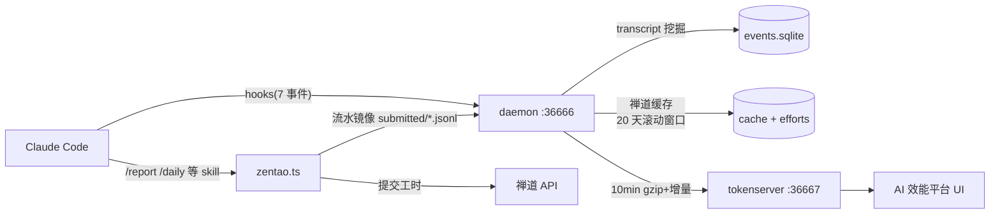

# shine-worklog 开发手册

面向**接手开发/维护本项目的工程师**的完整文档(非用户使用说明,用户向见根目录 README.md)。
目标:读完本手册能独立理解架构、定位代码、安全地改功能、完成构建与发布。

## 阅读顺序(新人路线)

1. [01-overview.md](01-overview.md) — 项目是什么、三大件、技术栈
2. [02-architecture.md](02-architecture.md) — 架构图与端到端数据流(**最重要**)
3. [03-directory.md](03-directory.md) — 目录结构导览
4. [08-data.md](08-data.md) — 数据与文件布局(排障必读)
5. 按需深入子系统:[04-hooks](04-hooks.md) / [05-daemon](05-daemon.md) / [06-skills](06-skills.md) / [07-tokenserver](07-tokenserver.md) / [13-ui-dashboard](13-ui-dashboard.md)
6. [10-mechanisms.md](10-mechanisms.md) — 核心机制专题(工时算法/水位防重/缓存窗口/AI 占比)
7. [09-api.md](09-api.md) — HTTP API 参考
8. [14-env-and-config.md](14-env-and-config.md) — 环境变量与配置清单
9. [11-build-release.md](11-build-release.md) — 构建、测试、发版、部署
10. [12-runbook.md](12-runbook.md) — 运维 FAQ 与交接清单

## 仓库既有专题文档(本手册之外)

| 文档 | 主题 |
|---|---|
| [设计文档.md](../设计文档.md) | 原始设计目标与方案 |
| [对话时长统计说明.md](../对话时长统计说明.md) | 工时 gap-aware 口径的权威说明 |
| [shine-worklog 子命令.md](../shine-worklog%20子命令.md) | skills 各命令使用说明(AI 执行视角) |
| [部署说明.md](../部署说明.md) | 新机器部署(npx install 流程) |
| [测试报告-Token对齐ccusage.md](../测试报告-Token对齐ccusage.md)([精简版](../测试报告-Token对齐ccusage-精简版.md)) | Token 统计与 ccusage 对齐验证 |
| [tokenserver/README.md](../tokenserver/README.md) / [tokenserver/数据说明.md](../tokenserver/数据说明.md) | 效能平台部署与 AI 占比口径权威说明 |

## 一页速览

- 语言/运行时:TypeScript + Bun(零 npm 运行时依赖,skills 层零依赖)
- 数据:本地 SQLite(events.sqlite / tokens.db)+ JSON 文件
- 前端:React(dashboard/效能平台)/ 原生 HTML(报表,自包含无依赖)
- 发布:npm 纯源码包,daemon autoUpdate 自升级
